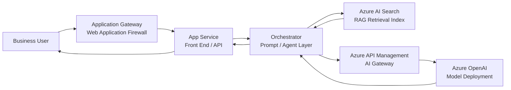

# Azure AI POC to Production-Ready RAG

This repository supports my technical blog post about moving an Azure AI proof of concept toward a production-ready Retrieval Augmented Generation solution on Azure.

The goal is not to build an over-engineered enterprise platform from day one. The goal is to document the practical architecture thinking required when a simple Azure AI demo needs to become a secure, reliable, and supportable business solution.

## Repository purpose

Many Azure AI proof of concepts start with a simple flow:

```text
User → Chat UI → Orchestrator → Test data → Azure OpenAI model → Response
```

That is enough to prove the idea, but it is not enough for production.

A production-ready direction needs to consider:

* trusted business data
* Azure AI Search for retrieval
* Microsoft Foundry model deployments
* private networking
* managed identity
* API gateway patterns
* throttling and quota handling
* monitoring and cost visibility
* RAG evaluation
* clear business ownership

This repository captures those concepts in a simple, readable format for business owners, Azure engineers, solution architects, and technical leads.

## Repository structure

```text
azure-ai-poc-to-production-rag/
├── README.md
├── docs/
│   └── architecture-notes.md
├── diagrams/
│   └── azure-ai-rag-flow.mmd
├── samples/
│   └── placeholder.md
└── references.md
```

## Supporting files

| File                                                             | Purpose                                                                                                                                                      |
| ---------------------------------------------------------------- | ------------------------------------------------------------------------------------------------------------------------------------------------------------ |
| [docs/architecture-notes.md](docs/architecture-notes.md)         | Detailed architecture notes explaining the POC-to-production journey, RAG design, private networking, gateway pattern, identity, monitoring, and evaluation. |
| [diagrams/azure-ai-rag-flow.mmd](diagrams/azure-ai-rag-flow.mmd) | Mermaid architecture diagram showing the high-level Azure AI RAG request flow.                                                                               |
| [samples/placeholder.md](samples/placeholder.md)                 | Placeholder for future sample code, Bicep modules, API Management policies, or ingestion scripts.                                                            |
| [references.md](references.md)                                   | Microsoft Learn and Azure architecture references used to validate the design direction.                                                                     |

## Architecture diagram

The high-level architecture flow is stored as a Mermaid diagram here:

[View Mermaid diagram source](diagrams/azure-ai-rag-flow.mmd)



## Target audience

This repository is written for:

* business owners reviewing an Azure AI proposal
* Azure engineers building AI-enabled workloads
* solution architects designing production-ready AI platforms
* technical leads responsible for security, operations, and delivery
* anyone moving from an AI demo to an enterprise implementation

## High-level architecture

A basic production direction for an Azure AI RAG solution can look like this:

```text
User
  → Application Gateway with WAF
  → App Service or front-end application
  → Orchestrator or agent layer
  → Azure AI Search
  → Azure OpenAI model in Microsoft Foundry
  → Response grounded in business data
```

The architecture may change depending on the organisation, but the key idea remains the same: separate the user experience, orchestration logic, retrieval layer, model access, network controls, and operational responsibilities.

## Core Azure services

| Area                | Azure service / capability             | Purpose                                                           |
| ------------------- | -------------------------------------- | ----------------------------------------------------------------- |
| AI platform         | Microsoft Foundry                      | Build, manage, and deploy AI solutions                            |
| Language model      | Azure OpenAI model deployments         | Generate responses from grounded context                          |
| Retrieval           | Azure AI Search                        | Index and retrieve relevant business content                      |
| Application hosting | Azure App Service                      | Host the front end, API, or orchestration layer                   |
| Network security    | Private endpoints and VNet integration | Reduce public exposure for sensitive workloads                    |
| Ingress protection  | Application Gateway with WAF           | Protect and inspect inbound traffic                               |
| Gateway layer       | Azure API Management                   | Centralise model access, routing, quotas, and throttling controls |
| Identity            | Managed identity and RBAC              | Avoid secrets and apply least privilege                           |
| Monitoring          | Azure Monitor and Log Analytics        | Track performance, errors, usage, and operational health          |

## RAG pipeline

A Retrieval Augmented Generation solution is only as good as its retrieval process.

The practical pipeline looks like this:

```text
Documents
  → Cleaning
  → Chunking
  → Metadata enrichment
  → Embeddings
  → Azure AI Search index
  → Retrieval
  → Model response
  → Evaluation
```

Important design decisions include:

* which documents are trusted sources
* how documents are split into chunks
* what metadata is stored
* whether search should be vector, keyword, hybrid, or semantic
* how source references are shown to users
* how answer quality is tested
* how stale content is updated or removed

For more detail, see:

[Architecture notes](docs/architecture-notes.md)

## POC vs production

| POC concern                      | Production concern                                                  |
| -------------------------------- | ------------------------------------------------------------------- |
| Can the model answer a question? | Can the solution answer reliably using trusted data?                |
| Can we upload a few documents?   | Can we maintain an indexed knowledge source over time?              |
| Can users try a demo?            | Can real users access it securely?                                  |
| Does the response look good?     | Is the answer grounded, traceable, and evaluated?                   |
| Can the app call the model?      | Can the platform handle quota, throttling, routing, and monitoring? |
| Is it impressive?                | Is it supportable?                                                  |

## Gateway pattern

In a simple POC, the application may call the Azure OpenAI endpoint directly.

In production, an API gateway should be considered between the application and model deployments.

```text
Application → API Management → Primary model deployment
                           → Secondary deployment or fallback path
```

This helps with:

* centralised access control
* quota and token management
* throttling behaviour
* routing between deployments
* separating application code from backend model changes
* supporting multiple teams or applications

The design is expanded in:

[Architecture notes: API gateway pattern](docs/architecture-notes.md#10-api-gateway-pattern)

## Private networking

For sensitive business data, private networking should be reviewed early.

A production design may include:

* private endpoints for AI services, search, storage, and supporting resources
* disabled public network access where appropriate
* VNet integration for application workloads
* private DNS zones
* managed identity for service-to-service access
* diagnostic logging for security and troubleshooting

Private endpoints are not just a checkbox. They require proper DNS, routing, RBAC, and operational support.

More detail:

[Architecture notes: private networking](docs/architecture-notes.md#12-private-networking)

## Evaluation

RAG quality should be tested, not guessed.

Useful checks include:

* answer correctness
* retrieval precision
* retrieval recall
* groundedness
* relevance
* citation quality
* response consistency
* failure behaviour when the answer is not in the source data

Evaluation should be repeated when documents, prompts, models, chunking, or indexing logic changes.

More detail:

[Architecture notes: evaluation](docs/architecture-notes.md#15-evaluation)

## Practical implementation path

A sensible delivery path is:

1. Choose one clear business use case.
2. Select a small set of trusted documents.
3. Build a basic RAG flow with Azure AI Search and a Foundry model deployment.
4. Add logging and simple evaluation questions.
5. Validate answer quality with business users.
6. Add private networking and identity controls.
7. Add API Management if multiple clients, deployments, quotas, or routing rules are required.
8. Automate deployment with infrastructure as code.
9. Monitor cost, usage, latency, and errors.
10. Improve chunking, metadata, retrieval, and evaluation over time.

## What this repo is not

This repository is not a full production implementation.

It is a reference companion for architecture thinking and technical planning. It can be extended later with Bicep modules, sample app code, deployment pipelines, API Management policies, or RAG evaluation scripts.

## Related blog post

This repository supports the blog post:

**From Azure AI POC to Production-Ready RAG**

Topics covered:

* Azure AI POC limitations
* Microsoft Foundry
* Azure AI Search
* RAG architecture
* private endpoints
* API gateway pattern
* throttling and HTTP 429
* evaluation and production readiness

## Suggested future additions

Possible future additions to this repository:

* Bicep modules for the core Azure resources
* Azure AI Search index example
* sample document ingestion pipeline
* API Management policy examples
* GitHub Actions or Azure DevOps deployment pipeline
* RAG evaluation checklist
* sample architecture decision records

These are intentionally not included yet to avoid making the repository look like a fake implementation before the working samples exist.

## References

See:

[references.md](references.md)

## Author

Maxim Sokolov
Azure Solution Architect / Cloud Infrastructure Architect

This repository reflects hands-on Azure architecture notes from working with infrastructure, cloud platforms, and AI implementation.
